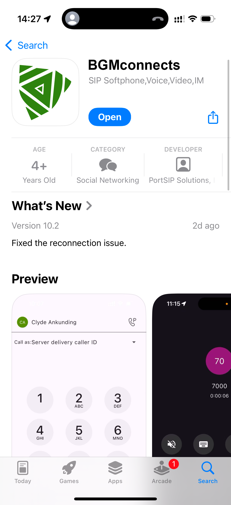

# BGMconnects Mobile App

BGMconnects is a versatile unified communications app that allows you to manage your calling service from your **desktop computer**, **web browser**, or **mobile device**. With a single application, you can:

* Make and receive calls
* Send and receive text messages
* Participate in group chats and share information with colleagues and contacts
* View customer contact history
* Manage call forwarding settings
* Access voicemail messages

All communication features are delivered through one secure, easy-to-use platform.

***

### Why BGMconnects

The all-new BGMconnects app is designed to help you **call, message, meet, and get work done**—all from one place:

* **Brings everyone together** to collaborate and deliver exceptional work
* **Adapts to you**, with a personalized user experience
* **Gives you flexibility**, allowing you to choose how and where you work

***

### Downloading BGMconnects

#### Mobile Devices

You can download BGMconnects directly from your mobile device:

* Open the **App Store** (iOS) or **Google Play Store** (Android)
* Search for **BGMconnects**
* Download and install the app

<!--#### BGMconnects Website

You can also download the latest versions of BGMconnects from the [BGMconnects website](https://www.bgmconnects.com/download-app/), which provides installers and links for supported platforms.
-->

<figure><figcaption></figcaption></figure>

