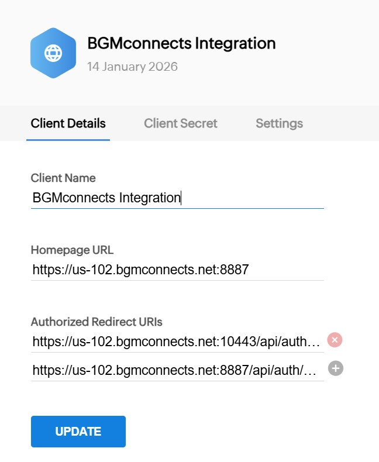

# ZOHO CRM

### Zoho CRM Integration Overview

Improve your team’s productivity with **the PBX’s native Zoho CRM integration**. This integration automatically matches incoming and outgoing calls with **Zoho contacts, leads, and accounts**, and logs call activities—including **call records, call recordings, and AI transcriptions**—to the appropriate CRM records.

By eliminating manual data entry and providing agents with real-time customer context, this integration helps teams work more efficiently and deliver a consistently superior customer experience.

***

### Key Capabilities

#### Caller ID to Contact Name

Inbound calls automatically trigger a Zoho CRM lookup to identify the caller and display the associated contact name.

#### Contact Lookup from BGMconnects app

When searching by name in **BGMconnects for Windows, macOS, or Web Client**, the system queries Zoho CRM and matches contacts based on phone numbers.

#### Automatic Call Journaling

All **trunk calls** are automatically logged in the Zoho Contact Card as CRM call activities. Agents can also append call notes at any time.

#### Create New Contacts Automatically

For calls from unknown numbers, agents can create new **Zoho contacts or leads** directly from the PBX client.

#### Recording and AI Transcription Logging

Call recording links and AI transcription links are automatically attached to the corresponding Zoho CRM activity.

***

### Supported Zoho Editions

The PBX Zoho CRM integration is supported for the following Zoho CRM editions:

* Standard
* Professional
* Enterprise
* Ultimate

***

### Step 1: Configure the Zoho Application

1. Sign in to the [Zoho Developer Console](https://accounts.zoho.com/developerconsole).
2. Click **Add Client**.
3. Select **Server-based Applications** as the client type.
4. Enter a **Client Name**, for example: `BGMconnects Integration`
5. Enter the **Homepage URL**, which is the URL of your PBX Admin Console, for example:\
   `https://pbx.bgmconnects.com:8887`
6.  In **Authorized Redirect URIs**, add the PBX callback URL:\
    `https://pbx.bgmconnects.com:8887/api/auth/callback/zoho`

    > **Note:** Replace `pbx.bgmconnects.com` with your actual PBX host name.
7. Click **Create**.
8. Zoho will generate a **Client ID** and **Client Secret**.

<figure><figcaption></figcaption></figure>

Securely store the **Client ID** and **Client Secret**. These credentials are required when configuring the PBX. Treat them as confidential and rotate them immediately if you suspect they have been compromised.

***

### Step 2: Configure the PBX

#### Enable CRM at the Tenant Level

Log in to the **BX Web Portal** as a **System Administrator**, then navigate to **Tenants**, select the target tenant, and click **Edit**.

Open the **Features** tab and ensure that the **CRM** option is enabled.

> **Important:** CRM integration will not function unless this feature is enabled for the tenant by a System Administrator.

Alternatively, you may sign in directly as the **Tenant Administrator** for the desired tenant.

***

#### Configure Zoho CRM Integration

1. Navigate to **Integrations > CRM**.
2. From the **Select a CRM solution** dropdown, choose **Zoho**.
3. Enter the **Client ID** and **Client Secret** obtained in Step 1.

***

#### Configure CRM Behavior

<figure><figcaption></figcaption></figure>

#### Contact Lookup Order

Define the priority for Zoho CRM searches:

* Contacts
* Leads
* Accounts

#### Query CRM

Specify when the PBX should query Zoho CRM:

* **Always query**
* **Only when not found in PBX CRM contacts**

#### Log Calls as Activities

Enable this option to automatically log calls as Zoho CRM activities.

When enabled, a call recording link can be included in the activity:

* **Private Recording Link** – Authentication with the PBX is required to access the recording.
* **Public Recording Link** – Authentication with the PBX is not required.

#### Create Contacts for New Numbers

Allow agents to create CRM records when calls come from unknown numbers.

Choose the record type to create:

* Contact
* Lead

#### Zoho Region

Select the region where your Zoho account is hosted:

* United States (US)
* Europe (EU)
* India (IN)
* Japan (JP)
* Canada (CA)
* Saudi Arabia (SA)

***

#### Authorize Zoho Access

1. Click **Authorize**. A new browser tab will open.
2. Sign in using the **Zoho user account** that should grant access _(do not use a developer account)_.
3. Click **Accept** to authorize the PBX to access Zoho CRM data.

Once authorization is complete, the integration becomes active immediately.
